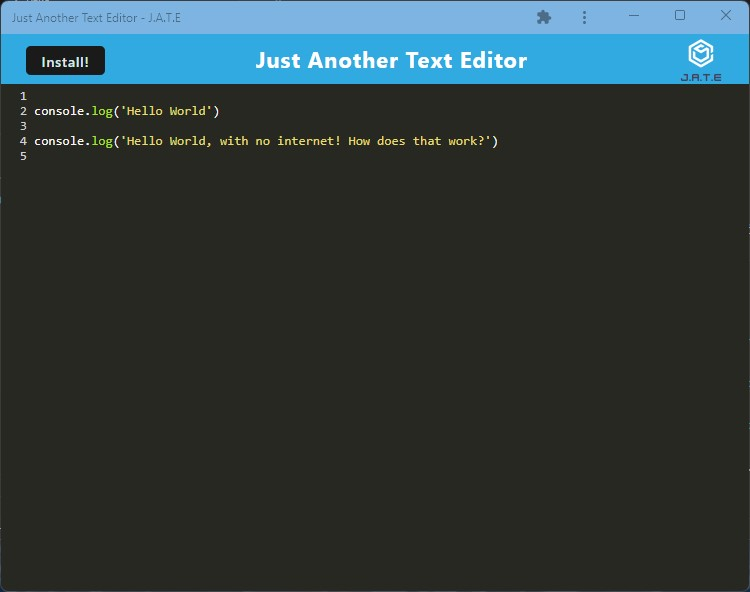

# PWA-texteditor

## Table of Contents 
* [Description](#Description) 

* [Installation](#Installation) 

* [Usage](#Usage) 

* [License](#License) 

* [Contributing](#Contributing) 

* [Testing](#Testing) 

* [Questions](#Questions) 

* [Screenshots](#Screenshots) 

### Description
Single page text editor application that meets Progressive Web Application criteria. Application is fully usable offline and can be used in both web and app form. 

### Installation
1. `npm install` into root directory, to install required application dependencies.
2. `npm start` to start application

### Usage
Available npm scripts:
* start:dev
* start
* server
* build
* install
* client

Hosted application can be tested via: https://jate-texteditor-8463ed25bde3.herokuapp.com/

### License
Further information regarding this specific license can be found via: https://opensource.org/license/mit/.  

### Contributing
Open <a href="https://github.com/MisterBham/PWA-texteditor/issues">Issues</a> on the GitHub repo!

### Testing
No testing provided at this time

### Questions
Should you have any further questions, please reach the developer at: misterbham.dev@gmail.com.   
GitHub: <a href="https://github.com/MisterBham">MisterBham</a>.   

### Screenshots
   
